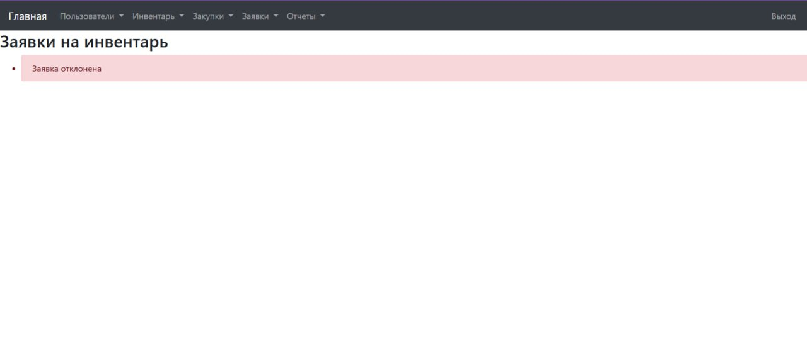
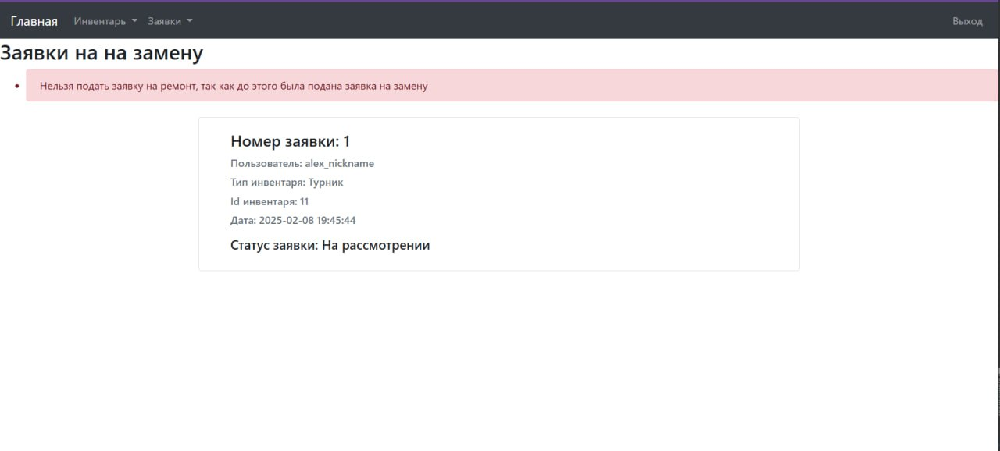

Эффективный учет и контроль спортивного инвентаря в школе играет
важную роль в обеспечении высокого уровня проведения спортивных
мероприятий и занятий физической культурой. \
\
Управление спортивным инвентарём через веб-интерфейс может значительно облегчить отслеживание наличия, состояния и
распределения спортивного инвентаря, а также планирование его закупок.

  #### Склонируйте репозиторий
  ```
  git clone https://github.com/QvkkpotentialExplorer/Inventory
  ```
  #### Перейдите в папку Inventory
  ```
  cd Inventory
  ```
  #### Создайте и активируйте виртуальное окружение 
  Windows:
  ```
  python -m venv venv
  ```
  ```
  cd venv/scripts && activate
  ```
  Linux:
  ```
  sudo apt install -y python3-venv && python3 -m venv venv
  ```
  ```
  source venv/scripts/activate
  ```
  #### Выйдете из venv/scripts
  ```
  cd ../../
  ```
  #### Скачайте все требования
  Windows:
  ```
  pip install -r requirements.txt
  ```
  Linux:
  ```
  pip3 install -r requirements.txt
  ```
   #### Запустите проект
   Windows
  ```
  python app.py
  ```
  Linux
  ```
python3 app.py
  ```
## Добавление администратора  
1. **Через веб-интерфейс:**  
   - Зайдите под профилем с ролью "Администратор"  
   - Перейдите в раздел "Пользователи"  
   - Нажмите "Добавить пользователя"  
   - В появившейся форме выберите роль, логин, пароль и другие данные  

2. **Через консольную команду:**  
   Запустите следующую команду в терминале (без кавычек):  

   ```
   flask admin addadmin Логин Пароль 
   ```


| Блок-схема | Код |
|----------|----------|
|||
|||
|||


#### №1  Регистрация пользователя в системе.
Пользователь должен осуществить ввод имени, никнейма, пароля и повторного пароля. Для успешной регистрации пароли должны совпадать. \
\


#### №2  Авторизация пользователя в системе.
Пользователь должен ввести никнейм и пароль от своего аккаунта, после чего он может успешно войти на сайт. \
\


#### №3  Добавление позиций инвентаря.
Администратор создаёт тип предмета и описание предмета. \
\


#### №4  Редактирование позиций инвентаря.
Администратор редактирует состояние предмета инвентаря. \
\


#### №5  Удаление позиций инвентаря.
Администратор может удалять различные позиции инвентаря. \
\


#### №6  Добавление в план закупок.
Администратор может составлять и просматривать план закупок. \
\
 \
\


#### №7  Работа с заявками со стороны администратора.
Администратор видит заявку на получение/ремонт/замену предмета инвентаря, может её отклонить или принять. Также были показаны некоторые нестандартные ситуации. \
\
 \
\
 \
\


#### №8  Работа с заявками со стороны пользователя.
Пользователь может создавать различные заявки на получение/ремонт/замену предметов инвентаря. \
\
 \
\



